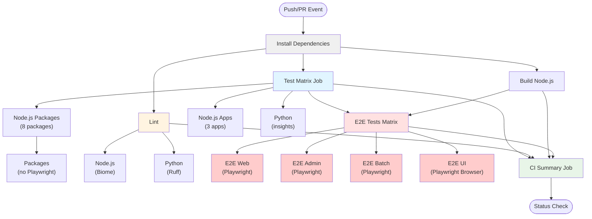

# CI Workflow Architecture

## Overview

This document describes the unified CI workflow architecture that consolidates Node.js and Python testing into a single workflow with matrix-based parallel execution.

## Workflow Structure



## Matrix Strategy

### Test Job Matrix

The test job uses a matrix strategy to run tests for all packages in parallel:

| Package Name | Language | Notes |
|--------------|----------|-------|
| @shinju-date/composable-fetch | node | Unit tests |
| @shinju-date/health-checkers | node | Unit tests |
| @shinju-date/helpers | node | Unit tests |
| @shinju-date/logger | node | Unit tests |
| @shinju-date/msw-handlers | node | Unit tests |
| @shinju-date/temporal-fns | node | Unit tests |
| @shinju-date/youtube-api-client | node | Unit tests |
| @shinju-date/youtube-scraper | node | Unit tests |
| @shinju-date/admin | node | Unit tests |
| @shinju-date/batch | node | Unit tests |
| @shinju-date/web | node | Unit tests |
| @shinju-date/insights | python | Tests (path: ./apps/insights) |

**Note**: UI package browser tests have been moved to E2E matrix.

### E2E Test Matrix

E2E tests run after test and build jobs pass:

| Target | Type | Playwright Required |
|--------|------|-------------------|
| web | app | Yes |
| admin | app | Yes |
| batch | app | Yes |
| **ui** | **package** | **Yes (browser tests)** |

## Playwright Version Management

### Version Extraction

For packages and apps that require Playwright, the version is extracted dynamically:

```bash
# For packages (E2E UI browser tests)
pnpm --filter @shinju-date/{package} exec playwright --version | grep -oE '[0-9]+\.[0-9]+\.[0-9]+'

# For E2E apps
cd apps/{app-name} && pnpm exec playwright --version | grep -oE '[0-9]+\.[0-9]+\.[0-9]+'
```

### Cache Keys

Playwright browser cache keys are structured as:

- **E2E tests**: `playwright-e2e-{target-name}-{version}-{os}`

This ensures:
- Each E2E target (web, admin, batch, ui) has its own cache
- Cache is invalidated when Playwright version changes
- Cache is OS-specific

### Conditional Playwright Setup

Playwright is only installed for E2E jobs:

1. **Get Playwright version**: Extracts version from the package or app
2. **Cache check**: Checks if browsers are already cached
3. **Install (conditional)**: Only installs if cache miss occurs
4. **Run tests**: Tests run with cached browsers

## Python Integration

The Python app (`@shinju-date/insights`) is integrated into the workflow:

- **Test Matrix**: Runs tests with configurable `path` field
- **Lint Job**: Runs `poe lint` and `poe format-check`
- Uses `uv` for dependency management
- Failures are captured in the summary job

### Python Path Configuration

Python packages in the matrix can specify their directory:

```yaml
- name: "@shinju-date/insights"
  language: "python"
  path: "./apps/insights"
```

This allows multiple Python products in different directories.

## Status Check

### Single Required Check

Only the **CI Summary** job is required as a status check for branch protection. This job:

1. Depends on all other jobs (install, test, lint, build, e2e)
2. Checks if all dependencies succeeded
3. Fails if any dependency failed
4. Provides a single point of verification

### Benefits

- **Simplified management**: Only one status check to configure
- **Clear visibility**: Single check shows overall CI health
- **Reduced noise**: No need to track multiple individual checks

## Workflow Benefits

### Install Job

- **Shared cache**: Install dependencies once, reuse across jobs
- **Parallel efficiency**: Test, lint, build run in parallel after install
- **Faster startup**: Jobs start immediately with cached dependencies

### Parallel Execution

- Install job prepares dependencies
- 12 test matrix jobs + lint + build = 14 parallel jobs (after install)
- E2E tests run after test + build complete (4 more parallel jobs)
- Total: 1 install + 14 parallel + 4 E2E = 19 jobs

### Efficiency

- Install job caches dependencies for all Node.js jobs
- Playwright setup is conditional and cached (E2E only)
- Independent cache keys prevent cache thrashing
- Turbo cache speeds up builds and tests
- E2E only runs after lighter tests pass

### Maintainability

- Single workflow file to maintain
- Clear matrix configuration
- Easy to add new packages/apps

### Visibility

- All tests visible in single workflow run
- Matrix view shows individual package results
- Summary job provides overall status

## Adding New Packages

To add a new package to the CI:

1. Add entry to the test matrix in `.github/workflows/ci.yml`:

```yaml
# For Node.js packages
- name: "@shinju-date/new-package"
  language: "node"

# For Python packages
- name: "@shinju-date/new-python-package"
  language: "python"
  path: "./apps/new-python-package"
```

2. Ensure package has test script in `package.json` (for Node.js) or `pyproject.toml` (for Python)
3. For packages with browser tests requiring Playwright, add to E2E matrix instead:

```yaml
- name: "new-package"
  type: "package"
```

4. No changes needed to status checks (summary job handles it)

## Migration Notes

### Removed Workflows

The following workflows are replaced by the unified CI workflow:

- `.github/workflows/node.js.yml` - Node.js CI
- `.github/workflows/python.yml` - Python CI

### Status Check Configuration

Update branch protection rules to require only:

- `CI Summary` (replaces all individual checks)
