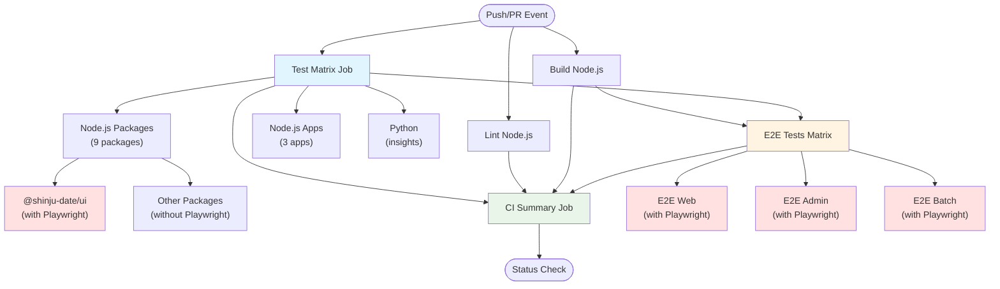

# CI Workflow Architecture

## Overview

This document describes the unified CI workflow architecture that consolidates Node.js and Python testing into a single workflow with matrix-based parallel execution.

## Workflow Structure



## Matrix Strategy

### Test Job Matrix

The test job uses a matrix strategy to run tests for all packages in parallel:

| Package Name | Language | Playwright Required |
|--------------|----------|-------------------|
| @shinju-date/composable-fetch | node | No |
| @shinju-date/health-checkers | node | No |
| @shinju-date/helpers | node | No |
| @shinju-date/logger | node | No |
| @shinju-date/msw-handlers | node | No |
| @shinju-date/temporal-fns | node | No |
| **@shinju-date/ui** | **node** | **Yes** |
| @shinju-date/youtube-api-client | node | No |
| @shinju-date/youtube-scraper | node | No |
| @shinju-date/admin | node | No |
| @shinju-date/batch | node | No |
| @shinju-date/web | node | No |
| @shinju-date/insights | python | No |

### E2E Test Matrix

E2E tests run separately for apps that require full build dependencies:

| App | Playwright Required |
|-----|-------------------|
| web | Yes |
| admin | Yes |
| batch | Yes |

## Playwright Version Management

### Version Extraction

For packages and apps that require Playwright, the version is extracted dynamically:

```bash
# For packages
pnpm --filter {package-name} exec playwright --version | grep -oE '[0-9]+\.[0-9]+\.[0-9]+'

# For E2E apps
cd apps/{app-name} && pnpm exec playwright --version | grep -oE '[0-9]+\.[0-9]+\.[0-9]+'
```

### Cache Keys

Playwright browser cache keys are structured as:

- **Unit tests**: `playwright-{package-name}-{version}-{os}`
- **E2E tests**: `playwright-e2e-{app-name}-{version}-{os}`

This ensures:
- Different packages/apps have independent caches
- Cache is invalidated when Playwright version changes
- Cache is OS-specific

### Conditional Playwright Setup

Playwright is only installed for jobs where `matrix.package.playwright: true`:

1. **Get Playwright version**: Extracts version from the package
2. **Cache check**: Checks if browsers are already cached
3. **Install (conditional)**: Only installs if cache miss occurs
4. **Run tests**: Tests run with cached browsers

## Python Integration

The Python app (`@shinju-date/insights`) is integrated into the same test matrix:

- Uses `uv` for dependency management
- Runs lint, format-check, and tests
- Failures are captured in the summary job

## Status Check

### Single Required Check

Only the **CI Summary** job is required as a status check for branch protection. This job:

1. Depends on all other jobs (test, lint, build, e2e)
2. Checks if all dependencies succeeded
3. Fails if any dependency failed
4. Provides a single point of verification

### Benefits

- **Simplified management**: Only one status check to configure
- **Clear visibility**: Single check shows overall CI health
- **Reduced noise**: No need to track multiple individual checks

## Workflow Benefits

### Parallel Execution

- All test jobs run simultaneously
- 13 test matrix jobs + lint + build = 15 parallel jobs
- E2E tests run after test + build complete (3 more parallel jobs)

### Efficiency

- Playwright setup is conditional and cached
- Independent cache keys prevent cache thrashing
- Turbo cache speeds up builds and tests

### Maintainability

- Single workflow file to maintain
- Clear matrix configuration
- Easy to add new packages/apps

### Visibility

- All tests visible in single workflow run
- Matrix view shows individual package results
- Summary job provides overall status

## Adding New Packages

To add a new package to the CI:

1. Add entry to the test matrix in `.github/workflows/ci.yml`:

```yaml
- name: "@shinju-date/new-package"
  language: "node"  # or "python"
  playwright: false  # or true if Playwright needed
```

2. Ensure package has test script in `package.json` (for Node.js)
3. No changes needed to status checks (summary job handles it)

## Migration Notes

### Removed Workflows

The following workflows are replaced by the unified CI workflow:

- `.github/workflows/node.js.yml` - Node.js CI
- `.github/workflows/python.yml` - Python CI

### Status Check Configuration

Update branch protection rules to require only:

- `CI Summary` (replaces all individual checks)
